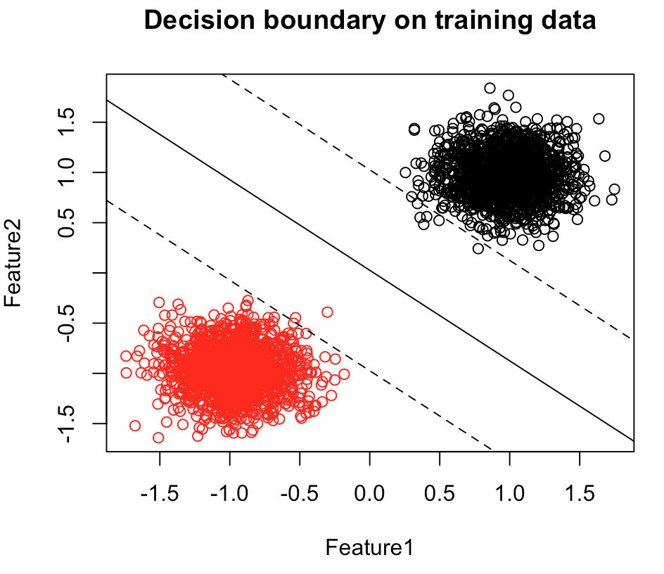
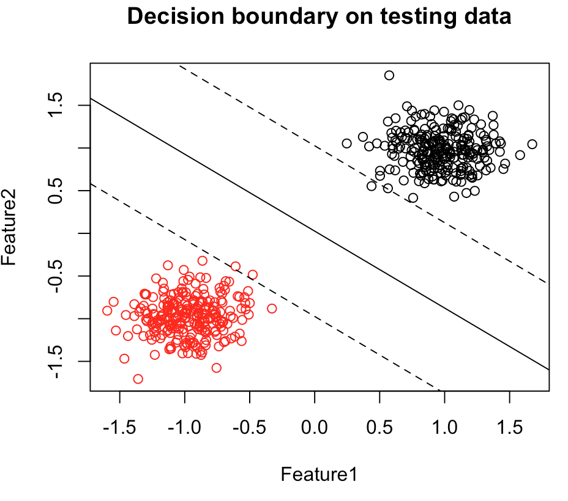
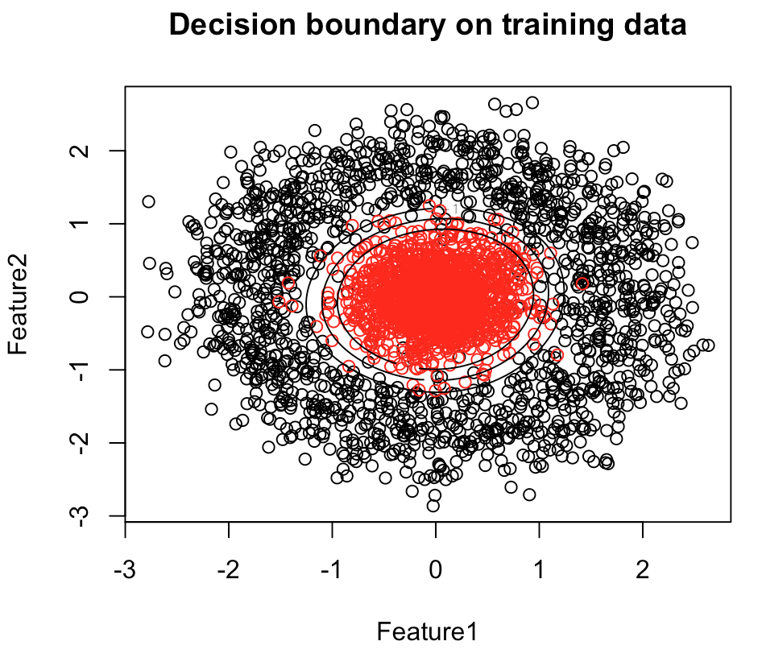
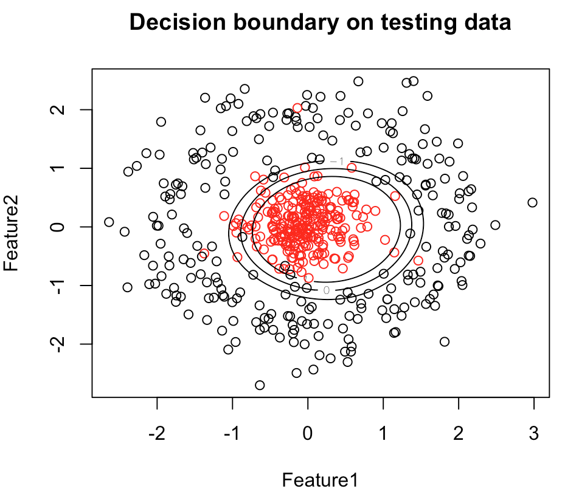

# Final project: C++ implementation of SMO algorithm for SVM and R package

For BIOSTAT 615, Fall 2018
## Table of Contents
1. [Description](#description)
2. [Sample data](#sample-data)
3. [Code structure](#code-structure)
4. [R package](#r-package)
5. [Program usage](#program-usage)
6. [Example](#example)
7. [Acknowledgement](#acknowledgement)
8. [Reference](#reference)

## Description
 * We implemented a support vector classifier using SMO algorithm in C++ and compiled it into this R package. It seeks to find a decision boundary with the greatest margin of separation between the input classes. If the training data are not linearly separable, a "soft-margin" (or regularized) version can be implemented that allows for misclassified samples. The output decision boundary can be linear, as it is with logisitc regression, or non-linear with the use of various kernels that map the input features to a higher-dimensional space.
 * Group members: RM, SC, MY

## Sample data
 * Linear-separable sklearn dataset ([make_blobs](https://scikit-learn.org/stable/modules/generated/sklearn.datasets.make_blobs.html)) 
 * Non-linear-separable sklearn dataset ([make_circles](https://scikit-learn.org/stable/modules/generated/sklearn.datasets.make_circles.html)) 
   
## Code structure
1. Kernel methods
 * Linear kernel: K(x, z) = x.transpose() * z + b
 * Gaussian kernel: K(x, z) = exp(-pow(|x − z|, 2) / 2 * pow(σ, 2))
2. train()
 * The train() function implements selection of the first α to optimize via the first choice heuristic and passes this value to examine_example().
3. examine_example()
 * The examine_example() implements the second choice heuristic to choose the second α to optimize, and passes the index of both α values to take_step().
4. take_steps()
 * take_step() carries out the meat of the calculations and computes the two new α values, a new threshold b, and updates the error cache.
5. Plots
 * With all the trained parameters, we conduct the predictions of the testing data and also plot the decision boundary for both the training data and testing data in R.

## R package
 * All the C++ codes and the R codes for plots are integrated into the Smo615 R package.

## Program usage 
Within R console
1. install.packages("Smo615_1.0.tar.gz", repos = NULL) 
2. library(Smo615) 
3. res=smo615(training_data_path, training_label_path, testing_data_path, testing_label_path, C_parameter, kernel_index) 
4. Parameters:

   <ul>
	
training_data_path

	<li>absolute path for training data file</li>
	<li>training data file shoule be space-split</li>
   </ul>
   <ul>
	
training_label_path

	<li>absolute path for training label file</li>
	<li>training label file shoule be one column</li>
   </ul>
   <ul>
	
testing_data_path

	<li>absolute path for testing data file</li>
	<li>testing data file shoule be space-split</li>
   </ul>
   <ul>
	
testing_label_path

	<li>absolute path for testing label file</li>
	<li>testing label file shoule be one column</li>
   </ul>
   <ul>
	
C_parameter

	<li>customized c for regularization</li>
   </ul>
   <ul>
	
kernel_index

	<li>0 for linear kernel and 1 for gaussian kernel</li>
   </ul>

## Example
 * Command: res=smo615('data/sample_data.txt', 'data/sample_label.txt', 'data/test_data.txt', 'data/test_label.txt', 1, 0)
 * Output plots:
 	<table>
 		<tr>
 			
 			
 		</tr>
 	</table>
 * Command: res=smo615('data/circle_train_data.txt', 'data/circle_train_label.txt', 'data/circle_test_data.txt', 'data/circle_test_label.txt', 1, 1)
 * Output plots:
 	<table>
 		<tr>
 			
 			
 		</tr>
 	</table>

## Acknowledgement
 * BIOSTAT 615 Teaching Team

## Reference
 * Platt, J.: Sequential Minimal Optimization: A Fast Algorithm for Training Support Vector Machine. Technical Report MSR-TR-98-14. Microsoft research (1998).
 * Wikipedia contributors. Support Vector Machine. Wikipedia, The Free Encyclopedia. Available at: https://en.wikipedia.org/wiki/Support_vector_machine. Accessed December 1, 2018.
 * Charest, J. (n.d.). Implementing a Support Vector Machine using Sequential Minimal Optimization and Python 3.5. Retrieved from https://jonchar.net/notebooks/SVM/.

